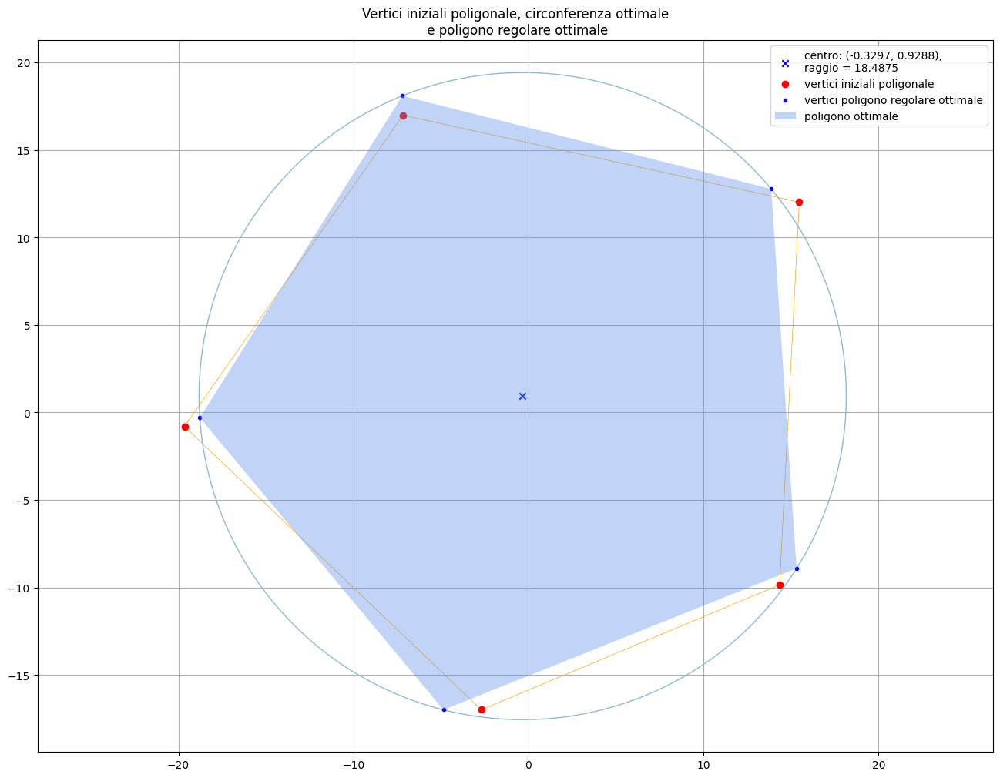

# Dalla poligonale al poligono regolare

## Una applicazione della regressione circolare

*Il programma Python `poligonoRegolare.py` e il notebook Jupyter `poligonoRegolare.ipynb` permettono di determinare la circonferenza che interpola nel modo ottimale i vertici di una poligonale che, a sua volta, approssima un poligono regolare. Viene quindi individuato il poligono regolare che si adatta nel modo migliore alla poligonale.*

### Consultazione

Nel caso si intenda visualizzare solo il contenuto del notebook `poligonoRegolare.ipynb` è sufficiente selezionare il file in questo stesso repository. In alternativa si può avviare *Nbviewer* con il pulsante sottostante

<a href="https://nbviewer.org/github/lrnzr/didatticaGeometria/tree/main/"><svg xmlns="http://www.w3.org/2000/svg" xmlns:xlink="http://www.w3.org/1999/xlink" width="148" height="20" role="img" aria-label="visualizza con: nbviewer"><title>visualizza con: nbviewer</title><linearGradient id="s" x2="0" y2="100%"><stop offset="0" stop-color="#bbb" stop-opacity=".1"/><stop offset="1" stop-opacity=".1"/></linearGradient><clipPath id="r"><rect width="148" height="20" rx="3" fill="#fff"/></clipPath><g clip-path="url(#r)"><rect width="87" height="20" fill="#555"/><rect x="87" width="61" height="20" fill="#007ec6"/><rect width="148" height="20" fill="url(#s)"/></g><g fill="#fff" text-anchor="middle" font-family="Verdana,Geneva,DejaVu Sans,sans-serif" text-rendering="geometricPrecision" font-size="110"><text aria-hidden="true" x="445" y="150" fill="#010101" fill-opacity=".3" transform="scale(.1)" textLength="770">visualizza con</text><text x="445" y="140" transform="scale(.1)" fill="#fff" textLength="770">visualizza con</text><text aria-hidden="true" x="1165" y="150" fill="#010101" fill-opacity=".3" transform="scale(.1)" textLength="510">nbviewer</text><text x="1165" y="140" transform="scale(.1)" fill="#fff" textLength="510">nbviewer</text></g></svg></a>

### Sperimentazione

Se invece si vuole sperimentare online in modo interattivo con il notebook va lanciato *Binder*.

Il caricamento sul server di *Binder* dell'intero repository richiede, per poter iniziare l'elaborazione, circa un minuto di attesa dopo il quale ci si trova in un ambiente dove sarà possibile selezionare il notebook e avviarne l'esecuzione passo passo oppure, da menu (`Run\Run All Cells`), eseguire in blocco tutte le celle.

Lorenzo Roi

